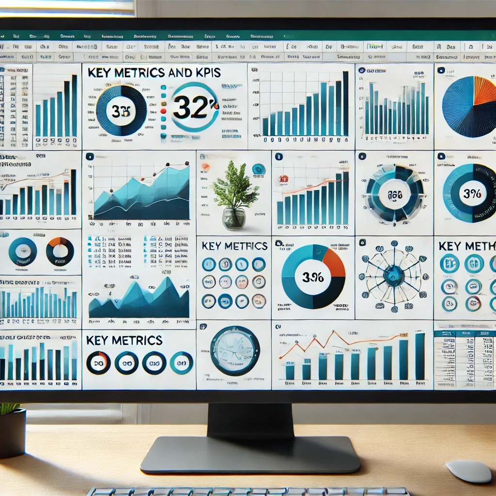
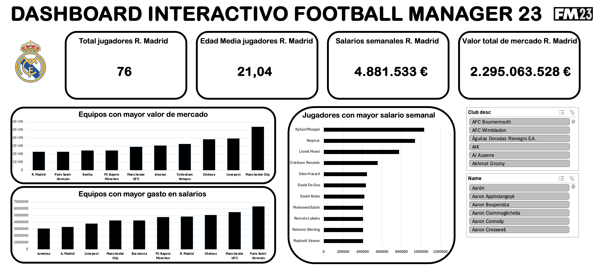
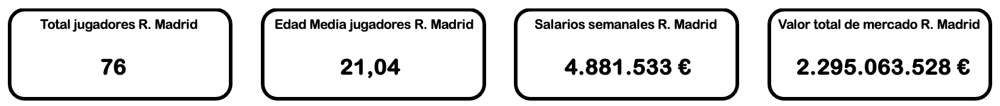
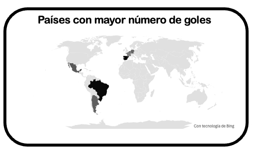
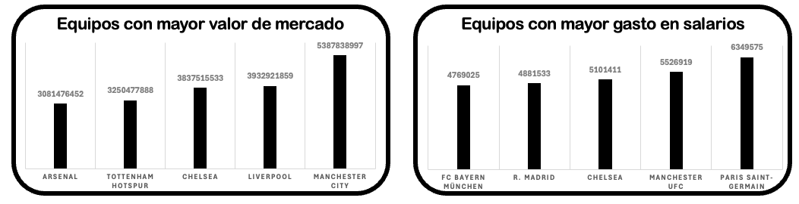
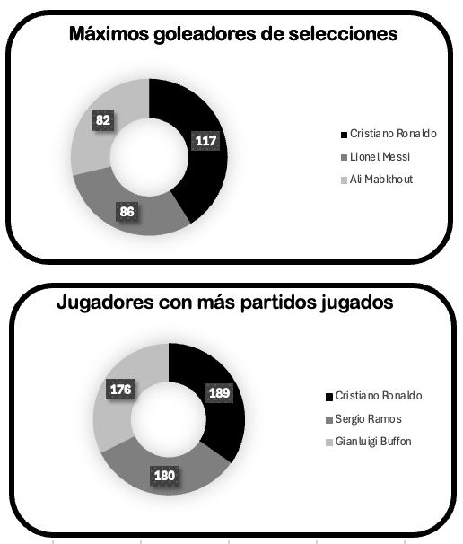

## 🚀 Proyecto 1: Dashboard & Análisis de Datos

## 🧠 Descripción del proyecto

Este proyecto ha consistido en la extracción de información de un archivo csv y su representación
visual, para su correcta comprensión. La finalidad del proyecto es limpiar y adecuar el set de
datos, para su correcto uso y tratamiento de los datos.

## 💡 Pasos para la realización del proyecto:

Vamos a ver las herramientas utilizadas y los pasos seguidos para su resolución:

1️⃣ En primer lugar, he obtenido el set de datos a través de un archivo csv, el cual
he importado en Excel.
 
2️⃣ Una vez importado, he transformado el set de datos, y he creado una tabla, eliminando
valores nulos y columnas que no he utilizado, eligiendo el correcto tipo de dato de
cada columna.
 
3️⃣ Después, con los datos transformados, he generado tablas dinámicas, a partir de las cuales
se pueden generar gráficos y tablas, con su respectivo segmentador de datos. Estos segmentadores,
tienen conexión con varios informes del dashboard, de manera que sea interactivo. Dejo por aquí,
una imagen visual del dashboard:

4️⃣ Finalmente, con los gráficos creados, he ajustado cada KPI y cada gráfico, dentro de su
cuadrado correspondiente para obtener un aspecto visual atractivo del dashboard.

## 📁 Estructura del proyecto

En cuanto a la estructura del proyecto, he decidido organizar los archivos en diferentes
carpetas, para obtener una visión más clara y facilitar la navegación entre los ficheros.
Encontramos una carpeta assets, que contiene las imágenes del proyecto. En este caso, he
introducido la imagen del banner como portada, y el dashboard principal,
que permite observar la relación que existe entre los diferentes gráficos.
Después, tenemos una carpeta src, donde se encuentran los ficheros .xlsx y .csv que he
utilizado, tanto el fichero que contiene la base de datos, como el que he generado para
resolver el dashboard que se propone.

## ✨ Conclusiones

Para terminar, este proyecto me ha sido muy útil porque he entendido la manera de crear
los gráficos y tablas que corresponden dependiendo de los datos que deseo mostrar.
Primero, los KPI´s que son valores estáticos y cuantificables, es decir, no presentan
variación a la hora de aplicar un filtro. En este caso, he utilizado información concreta
sobre el Real Madrid. Observamos como el Real Madrid es un equipo, con gran cantidad de
jugadores, en concreto jóvenes y grandes promesas. Además es uno de los equipos, con mayor
valor de mercado y mayor gasto en salarios. Visualización de los KPI´s: ⬇️
 

Por otro lado, podemos observar un mapa, con zonas de calor dependiendo de los países
que más goles han anotado. El mapa nos permite tener una visión más clara, para entender
la ubicación geográfica de los países más goleadores. Analizamos como los jugadores que
provienen de sudamérica, son los que más goles han anotado. Ejemplo del mapa: ⬇️
 

Además, podemos observar diferentes tablas de columnas 2D en vertical y horizontal, que
muestran la clasificación de equipos con mayor valor de mercado y gastos en salario. Analizamos
como el Chelsea, es el único equipo que entra en el top 5 tanto de equipos más valiosos, como
de equipos con mayor gasto en salarios. Aquí puedes observar la previsualización: ⬇️
 

Finalmente, he utilizado gráficos de anillo para mostrar información, de diferente manera
a la que realicé anteriormente, y dotarle un aspecto más completo al dashboard. Observamos
como Cristiano Ronaldo es el jugador con más goles, pero también el que más partidos ha
disputado. Por ello, podemos deducir que Leo Messi (segundo máximo goleador), es capaz de
anotar más goles en menos partidos disputados. Aquí dejo una previsualización de los
gráficos: ⬇️
 

 

💻 Muy ilusionado y preparado para seguir realizando este tipo de proyectos, y
aprender nuevas tecnologías y herramientas.

## 👤 Autor

Daniel Recio.
