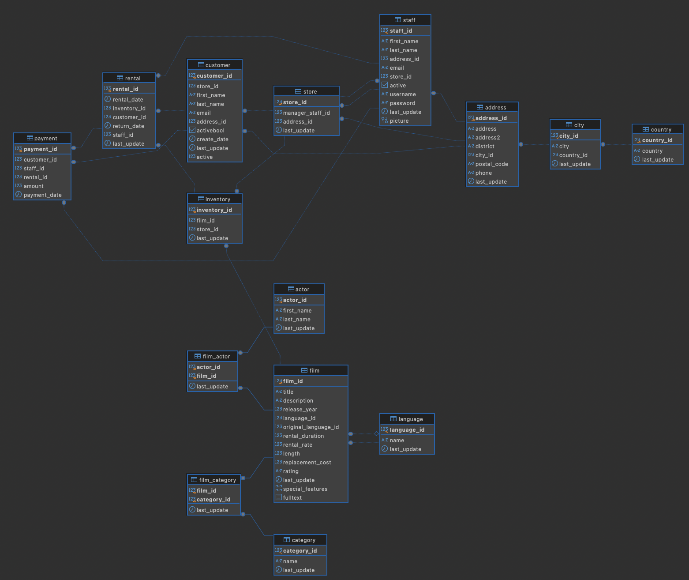
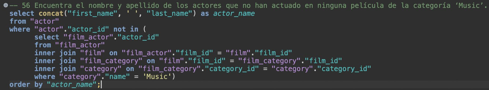

## 🚀 Proyecto 2: Consultas lógicas SQL

## 🧠 Descripción del proyecto

Este proyecto ha consistido en la resolución de una serie de queries que se plantean,
sobre una base de datos ficticia de películas. La finalidad del proyecto es entender
la relación que existe entre las diferentes tablas que componen la bbdd, resolviendo
los objetivos planteados en cada query.

## 💡 Pasos para la realización del proyecto:

Vamos a ver las herramientas utilizadas y los pasos seguidos para su resolución:

1️⃣ En primer lugar, he abierto la aplicación DBeaver y he creado una base de datos, que he
llamado films. Una vez creada y seleccionada por defecto, he abierto el fichero .sql que
contiene la información de la base de datos.
 
2️⃣ Una vez abierto el fichero, y creada la base de datos, he seleccionado la totalidad
del archivo y he ejecutado el script. Esto me ha permitido la creación de las tablas dentro de
su base de datos correspondiente.
 
3️⃣ Después, con las tablas creadas, he podido visualizar el esquema general de la base de datos,
permitiendo ver la relación y el flujo que siguen las tablas entre ellas. Dejo por aquí el esquema
general de las tablas:

4️⃣ Finalmente, con el conocimiento obtenido y entendiendo la correcta relación de las tablas, he realizado
las queries que se han ido proponiendo. Atendiendo siempre al enunciado y utilizando el mejor
formato de unión entre las diversas tablas (inner join, left join, cross join...)

## 📁 Estructura del proyecto

En cuanto a la estructura del proyecto, he decidido organizar los archivos en diferentes
carpetas, para obtener una visión más clara y facilitar la navegación entre los ficheros.
Encontramos una carpeta assets, que contiene las imágenes del proyecto. En este caso, he
introducido la imagen del banner como portada, y el esquema principal de la base de datos,
que permite observar la relación que existe entre las diferentes tablas.
Después, tenemos una carpeta src, donde se encuentran los ficheros .sql que he utilizado,
tanto el fichero que contiene la base de datos, como el que he generado para resolver
las queries que se proponen.
Finalmente, he añadido el archivo pdf, el cual incorpora los enunciados del proyecto y
los requerimientos finales de cada query.

## ✨ Conclusiones

Para terminar, este proyecto me ha sido muy útil porque he entendido la manera de crear
una base de datos totalmente vacía y como añadir contenido para después trabajar con él.
Destacaría el hecho de entender y relacionar varias tablas, a través de parámetros
coincidentes, para establecer las uniones entre ellas. Como por ejemplo, la resolución
de esta query, que me ha aportado gran valor:
 

En esta query, primero he concatenado el nombre y el apellido de los actores, para
obtenerlo en una única columnas. Después, he detallado que el id del actor (cada actor
posee un id único), no aparezca en las películas de la categoría Music. Relacionando
las tablas, para unir actor con categoría de las películas. Por último, he ordenado
los resultados a través del nombre completo del actor.
 

💻 Totalmente ilusionado y preparado para seguir realizando este tipo de proyectos, y
aprender nuevas tecnologías y herramientas.

## 👤 Autor

Daniel Recio.
