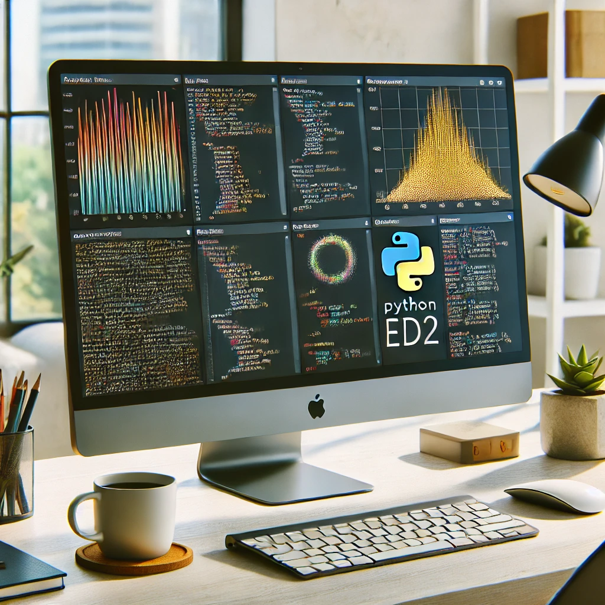

## 🚀 Proyecto 4: EDA con Python



## 🧠 Descripción del proyecto

Este proyecto ha consistido en un Análisis Exploratorio de Datos (EDA),
sobre un conjunto de datos específico con el objetivo de comprender su
estructura, identificar patrones y relaciones, y detectar cualquier
inconsistencia o valor atípico. Durante el proceso de EDA, se han aplicado
técnicas estadísticas y visuales para analizar la distribución de las variables,
explorar correlaciones entre ellas, y verificar la presencia de valores faltantes o anómalos.

## 📁 Estructura del proyecto

La estructura del proyecto es la siguiente:

```bash
├── assets/                 # Contiene las imágenes del proyecto
├── data/                   # Contiene las carpetas con la info
│   ├── raw_data/           # Contiene los datos en bruto
│   └── transform_data/     # Contiene el archivo transformado
├── notebooks/              # Contiene los archivos ipynb
├── src/                    # Contiene el archivo .py con las funciones
├── readme.md               # Descripción completa del proyecto
```

## 🛠️ Instalación y Requisitos

Este proyecto utiliza Python con Pandas, y necesita las siguientes dependencias:

- pandas
- numpy
- matplotlib.pyplot
- seaborn
- plotly

Para instalar las dependencias, puedes ejecutar el siguiente comando dentro de un entorno virtual:

```bash
pip3 install seaborn
```

## 🧾 Informe explicativo del análisis

## ✨ Conclusiones

Tras realizar el análisis exploratorio de los datos, se identificaron varias conclusiones importantes:

• La mayoría de los clientes tiene entre 20 y 60 años de edad.
• Se observó un predominio de personas casadas, respecto de personas solteras y divorciadas.
• Se encontraron los trabajos más predominantes dentro de la columna 'job', siendo: admin,
blue-collar y technician.
• En términos de próximos pasos, se recomienda realizar un análisis más detallado de las variables relacionadas
con la duración y considerar un modelo predictivo para predecir la duración del trabajo de los clientes.
<br>

💻 Me encuentro totalmente ilusionado y preparado para seguir realizando este tipo de proyectos, y
aprender nuevas tecnologías y herramientas.

## 👤 Autor

Daniel Recio.
